# Visual Diagrams - AWS Athena Lark Base Connector

This document contains all diagrams in **Mermaid** format.

## 📊 How to Use These Diagrams

### Option 1: View in GitHub/GitLab
- These diagrams render automatically in GitHub and GitLab
- Just view this file in your repository

### Option 2: Import to Diagrams.io (draw.io)
1. Copy the Mermaid code block
2. Go to https://app.diagrams.io/
3. Click "Arrange" → "Insert" → "Advanced" → "Mermaid"
4. Paste the code
5. Edit and export as needed

### Option 3: Export to PNG/SVG
1. Use Mermaid Live Editor: https://mermaid.live/
2. Paste the code
3. Download as PNG/SVG

---

## Table of Contents
1. [System Architecture Overview](#1-system-architecture-overview)
2. [Metadata Discovery Flows](#2-metadata-discovery-flows)
3. [Query Execution Flow](#3-query-execution-flow)
4. [Class Hierarchy](#4-class-hierarchy)
5. [Sequence Diagrams](#5-sequence-diagrams)
6. [Component Interaction](#6-component-interaction)

---

## 1. System Architecture Overview

### High-Level Architecture

---

## 2. Metadata Discovery Flows

### Flow Comparison Decision Tree

```mermaid
graph TD
    Start[Start: Choose Metadata Discovery Flow]

    Start --> Q1{Production or<br/>Development?}

    Q1 -->|Production| Q2{Schema changes<br/>frequently?}
    Q1 -->|Development| Q3{Need real-time<br/>schema updates?}

    Q2 -->|No - Stable| Flow1[Flow 1: Glue + Crawler<br/>✅ Best performance<br/>✅ AWS governance<br/>⚙️ Manual updates]
    Q2 -->|Yes - Dynamic| Flow2A[Flow 2: Lark Base Source<br/>✅ Auto updates on restart<br/>✅ No crawler needed<br/>⚠️ Cold start penalty]

    Q3 -->|Yes| Flow4[Flow 4: Experimental<br/>✅ Real-time schema<br/>✅ No caching<br/>⚠️ Higher latency]
    Q3 -->|No| Q4{Prefer folder-based<br/>organization?}

    Q4 -->|Yes| Flow3[Flow 3: Lark Drive Source<br/>✅ Visual organization<br/>✅ Folder = Database<br/>⚠️ Naming constraints]
    Q4 -->|No| Flow2B[Flow 2: Lark Base Source<br/>✅ Simple setup<br/>✅ Flexible naming<br/>✅ Metadata in Lark]

    Flow1 --> End[Deploy and Query!]
    Flow2A --> End
    Flow2B --> End
    Flow3 --> End
    Flow4 --> End

    style Start fill:#e1f5ff
    style Flow1 fill:#4CAF50
    style Flow2A fill:#2196F3
    style Flow2B fill:#2196F3
    style Flow3 fill:#FF9800
    style Flow4 fill:#9C27B0
    style End fill:#4CAF50
```

### Flow 1: Glue Catalog + Crawler

```mermaid
sequenceDiagram
    participant Admin
    participant Crawler as Crawler Lambda
    participant LarkAPI as Lark Base API
    participant Glue as AWS Glue Catalog
    participant Athena as Athena Query
    participant Connector as Athena Connector

    rect rgb(200, 220, 240)
        Note over Admin,Glue: One-Time Setup
        Admin->>Crawler: 1. Invoke Crawler Lambda
        Crawler->>LarkAPI: 2. List tables & fields
        LarkAPI-->>Crawler: Table metadata
        Crawler->>Glue: 3. Create/Update tables
        Note over Glue: Tables stored with<br/>larkBaseId, larkTableId<br/>in parameters
    end

    rect rgb(220, 240, 220)
        Note over Athena,LarkAPI: Query Time
        Athena->>Connector: 4. SELECT * FROM table
        Connector->>Glue: 5. Get table metadata
        Glue-->>Connector: Schema + IDs
        Connector->>LarkAPI: 6. Fetch data
        LarkAPI-->>Connector: Records
        Connector-->>Athena: Results
    end

    Note over Admin,Connector: ✅ Fast queries (cached)<br/>❌ Manual schema updates
```

### Flow 2: Lark Base Source (Direct)

### Flow 3: Lark Drive Source

### Flow 4: Experimental Provider

---

## 3. Query Execution Flow

### Complete Query Lifecycle

```mermaid
graph TB
    Start[User: SELECT * FROM table<br/>WHERE status='active'<br/>ORDER BY date DESC<br/>LIMIT 100]

    subgraph "Phase 1: Metadata"
        GetLayout[GetTableLayout]
        GetSchema[Get Table Schema]
        GetPartitions[getPartitions]
        TranslateFilter[Translate WHERE<br/>to Lark filter JSON]
        TranslateSort[Translate ORDER BY<br/>to Lark sort JSON]
        EstimateRows[Estimate Row Count<br/>via Lark API]
        CreatePartitions[Create Partition Block]
        GetSplits[GetSplits]
        CreateSplits[Create Split Objects]
    end

    subgraph "Phase 2: Data Reading"
        ReadRecords[ReadRecords<br/>for each split]
        GetIterator[Create Record Iterator]
        FetchPage1[Fetch Page 1<br/>500 records]
        FetchPage2[Fetch Page 2<br/>500 records]
        FetchPageN[Fetch Page N<br/>until complete]
        TypeConvert[Type Conversion<br/>Lark → Arrow]
        WriteBlocks[Write to Arrow Blocks]
    end

    Result[Return Results to Athena]

    Start --> GetLayout
    GetLayout --> GetSchema
    GetSchema --> GetPartitions
    GetPartitions --> TranslateFilter
    TranslateFilter --> TranslateSort
    TranslateSort --> EstimateRows
    EstimateRows --> CreatePartitions
    CreatePartitions --> GetSplits
    GetSplits --> CreateSplits

    CreateSplits --> ReadRecords
    ReadRecords --> GetIterator
    GetIterator --> FetchPage1
    FetchPage1 --> TypeConvert
    TypeConvert --> WriteBlocks
    WriteBlocks --> FetchPage2
    FetchPage2 --> WriteBlocks
    WriteBlocks --> FetchPageN
    FetchPageN --> WriteBlocks

    WriteBlocks --> Result

    style Start fill:#e1f5ff
    style GetPartitions fill:#fff3cd
    style TranslateFilter fill:#d4edda
    style TranslateSort fill:#d4edda
    style ReadRecords fill:#f8d7da
    style Result fill:#4CAF50
```

### Filter Pushdown Translation

---

## 4. Class Hierarchy

### Handler Classes

### Service Layer

### Metadata Provider Pattern

---

## 5. Sequence Diagrams

### Query Execution Overview

### Metadata Discovery (Strategy Pattern)

```mermaid
sequenceDiagram
    participant Athena
    participant Handler as BaseMetadataHandler
    participant Provider1 as LarkSourceMetadataProvider
    participant Provider2 as ExperimentalMetadataProvider
    participant Glue as AWS Glue
    participant Lark as Lark API

    Athena->>Handler: doGetTable(database, table)

    rect rgb(230, 255, 230)
        Note over Handler,Provider1: Try Provider 1
        Handler->>Provider1: getTableSchema()
        Provider1->>Provider1: Search in-memory cache

        alt Schema found in cache
            Provider1-->>Handler: Schema (cached)
            Handler-->>Athena: Return schema ✓
        else Not found
            Provider1-->>Handler: Empty
        end
    end

    rect rgb(255, 243, 205)
        Note over Handler,Lark: Try Provider 2
        Handler->>Provider2: getTableSchema()
        Provider2->>Provider2: Query Athena catalog
        Provider2->>Lark: Get table fields
        Lark-->>Provider2: Field definitions
        Provider2->>Provider2: Build schema dynamically

        alt Schema built
            Provider2-->>Handler: Schema (dynamic)
            Handler-->>Athena: Return schema ✓
        else Failed
            Provider2-->>Handler: Empty
        end
    end

    rect rgb(248, 215, 218)
        Note over Handler,Glue: Fallback to Glue
        Handler->>Glue: getTable()
        Glue-->>Handler: Table metadata
        Handler-->>Athena: Return schema ✓
    end
```

### Data Reading with Pagination

---

## 6. Component Interaction

### Complete System Interaction

### Parallel Split Execution

---

## 📝 Notes

### Editing Diagrams

1. **In Diagrams.io**:
   - Copy the Mermaid code
   - Arrange → Insert → Advanced → Mermaid
   - Edit the code and click "Insert"
   - The diagram will be editable as a diagram.io object

2. **Color Schemes**:
   - Blue (#e1f5ff): User/Input
   - Orange (#ff9900): AWS Services
   - Green (#4CAF50): Connector Components
   - Teal (#00d4aa): External APIs
   - Yellow (#fff3cd): Warning/Important
   - Red (#f8d7da): Critical path

3. **Export Options**:
   - PNG: For documentation
   - SVG: For scalable graphics
   - PDF: For reports
   - XML: For sharing diagrams.io files

### Best Practices

- **Keep it simple**: Don't overcomplicate diagrams
- **Use colors consistently**: Same color = same type of component
- **Add notes**: Explain complex parts
- **Update regularly**: Keep diagrams in sync with code

---

## 🔗 Related Documentation

- [ARCHITECTURE.md](./ARCHITECTURE.md) - Detailed architecture description
- [METADATA_DISCOVERY_FLOWS.md](./METADATA_DISCOVERY_FLOWS.md) - Flow comparison and setup
- [SEQUENCE_DIAGRAMS.md](./SEQUENCE_DIAGRAMS.md) - ASCII sequence diagrams
- [CLASS_DIAGRAMS.md](./CLASS_DIAGRAMS.md) - Class structure details

---

**Last Updated**: 2025-01-13
**Format**: Mermaid (Compatible with GitHub, GitLab, Diagrams.io)
