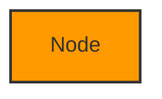

# Diagrams Import Guide - How to Use the Visual Diagrams

This guide explains how to use the diagrams from `DIAGRAMS.md` in various tools.

---

## 📊 Available Formats

All diagrams are created in **Mermaid** format, which is:
- ✅ Human-readable text format
- ✅ Version control friendly (Git)
- ✅ Renders automatically in GitHub/GitLab/Bitbucket
- ✅ Importable into Diagrams.io (draw.io)
- ✅ Convertible to PNG/SVG/PDF

---

## 🌐 Option 1: View in GitHub/GitLab (Easiest)

**No setup required!**

1. Push the repository to GitHub or GitLab
2. Open [DIAGRAMS.md](./DIAGRAMS.md)
3. The diagrams render automatically!

**Example**: https://github.com/your-repo/DIAGRAMS.md

✅ **Pros**: No setup, automatic rendering, always up-to-date
❌ **Cons**: Cannot edit, online only

---

## 🎨 Option 2: Import to Diagrams.io (Most Flexible)

### Method A: Using Mermaid Import

**Step-by-step**:

1. **Open Diagrams.io**
   - Go to https://app.diagrams.io/
   - Or use desktop app

2. **Create New Diagram**
   - Click "Create New Diagram"
   - Choose "Blank Diagram"

3. **Import Mermaid Code**
   - Click menu: `Arrange` → `Insert` → `Advanced` → `Mermaid...`
   - A dialog box will appear

4. **Paste the Code**
   - Open [DIAGRAMS.md](./DIAGRAMS.md)
   - Copy a Mermaid code block (everything between ```mermaid and ```)
   - Paste into the Mermaid dialog
   - Click "Insert"

5. **Edit and Customize**
   - The diagram is now editable!
   - Change colors, add shapes, rearrange
   - Export as PNG, SVG, PDF

**Video Tutorial**: https://www.youtube.com/watch?v=7_2IroEs6Is

### Method B: Using draw.io Plugin for VS Code

1. **Install Extension**
   - Open VS Code
   - Install "Draw.io Integration" extension
   - Install "Markdown Preview Mermaid Support" extension

2. **View Diagrams**
   - Open `DIAGRAMS.md`
   - Mermaid diagrams render in preview
   - Click to edit in draw.io

3. **Export**
   - Right-click diagram
   - Export as PNG/SVG

### Screenshot Tutorial

**Importing to Diagrams.io**:

```
┌─────────────────────────────────────┐
│ 1. Open app.diagrams.io             │
└─────────────────────────────────────┘
              ↓
┌─────────────────────────────────────┐
│ 2. Arrange → Insert → Advanced →    │
│    Mermaid                           │
└─────────────────────────────────────┘
              ↓
┌─────────────────────────────────────┐
│ 3. Paste Mermaid code               │
│                                     │
│  graph TB                           │
│    A[Start] --> B[End]              │
│                                     │
└─────────────────────────────────────┘
              ↓
┌─────────────────────────────────────┐
│ 4. Click "Insert"                   │
└─────────────────────────────────────┘
              ↓
┌─────────────────────────────────────┐
│ 5. Edit and export!                 │
│    ✅ PNG  ✅ SVG  ✅ PDF            │
└─────────────────────────────────────┘
```

---

## 🖼️ Option 3: Render to PNG/SVG (For Documentation)

### Using Mermaid CLI

**Install**:
```bash
npm install -g @mermaid-js/mermaid-cli
```

**Convert to PNG**:
```bash
# Extract a single diagram to file
cat > diagram.mmd << 'EOF'
graph TB
    A[Start] --> B[End]
EOF

# Render to PNG
mmdc -i diagram.mmd -o diagram.png
```

**Convert all diagrams**:
```bash
# Script to extract and convert all diagrams
./scripts/render-diagrams.sh
```

### Using Mermaid Live Editor

**Online tool** (no installation):

1. Go to https://mermaid.live/
2. Paste Mermaid code
3. Click "Actions" → "Download PNG" or "Download SVG"
4. Save the image

**Best for**: Quick exports, presentations, documentation

---

## 📱 Option 4: View in Markdown Editors

### Editors with Mermaid Support

| Editor | Support | Notes |
|--------|---------|-------|
| **VS Code** | ✅ Native | Install "Markdown Preview Mermaid Support" |
| **Typora** | ✅ Native | Renders automatically |
| **Obsidian** | ✅ Native | Great for knowledge base |
| **GitBook** | ✅ Native | For documentation sites |
| **Notion** | ❌ No | Use PNG export instead |
| **Confluence** | ⚠️ Plugin | Requires Mermaid plugin |

### VS Code Setup

1. **Install Extension**:
   ```
   Name: Markdown Preview Mermaid Support
   Id: bierner.markdown-mermaid
   ```

2. **Open DIAGRAMS.md**:
   - Right-click → "Open Preview"
   - Diagrams render automatically

3. **Export to HTML**:
   - Install "Markdown PDF" extension
   - Right-click → "Markdown PDF: Export (html)"

---

## 🌐 Option 5: Embed in Web Pages

### Static HTML

Create `diagrams.html`:

```html
<!DOCTYPE html>
<html>
<head>
    <title>Athena Lark Base Connector - Diagrams</title>
    <script src="https://cdn.jsdelivr.net/npm/mermaid/dist/mermaid.min.js"></script>
    <script>mermaid.initialize({startOnLoad:true});</script>
    <style>
        body { font-family: Arial, sans-serif; padding: 20px; }
        .mermaid { margin: 20px 0; }
    </style>
</head>
<body>
    <h1>Architecture Diagrams</h1>

    <h2>System Overview</h2>
    <div class="mermaid">
graph TB
    User[User] --> Athena[Amazon Athena]
    Athena --> Lambda[AWS Lambda Connector]
    Lambda --> Lark[Lark Base API]
    </div>

    <!-- Add more diagrams here -->
</body>
</html>
```

### In Documentation Sites

**GitBook**:
```markdown

graph TB
    A[Start] --> B[End]

```

**MkDocs** (with plugin):
```yaml
# mkdocs.yml
plugins:
  - mermaid2
```

**Docusaurus**:
```yaml
# docusaurus.config.js
themes: ['@docusaurus/theme-mermaid']
```

---

## 📤 Export Formats

### From Diagrams.io

| Format | Use Case | Size | Quality |
|--------|----------|------|---------|
| **PNG** | Presentations, Slack | Small | Good |
| **SVG** | Scalable, web | Small | Excellent |
| **PDF** | Reports, printing | Medium | Excellent |
| **XML** | Share editable | Large | N/A |
| **VSDX** | Microsoft Visio | Medium | Good |

### From Mermaid CLI

```bash
# PNG (default)
mmdc -i diagram.mmd -o diagram.png

# SVG (scalable)
mmdc -i diagram.mmd -o diagram.svg

# PDF (for reports)
mmdc -i diagram.mmd -o diagram.pdf

# High quality PNG
mmdc -i diagram.mmd -o diagram.png -w 2000 -H 1500
```

---

## 🎯 Recommended Workflow

### For Documentation

1. **Keep Mermaid source** in Git (`DIAGRAMS.md`)
2. **Render to PNG/SVG** for releases
3. **Embed in README** with ``

### For Presentations

1. **Import to Diagrams.io**
2. **Customize colors/layout** for your brand
3. **Export to PNG** at high resolution
4. **Insert into PowerPoint/Google Slides**

### For Collaboration

1. **View in GitHub** for quick reference
2. **Export to PNG** and share in Slack/Teams
3. **Share Diagrams.io XML** for editing
4. **Link to Mermaid Live** for quick edits

---

## 🛠️ Troubleshooting

### Diagram not rendering in GitHub

**Issue**: Mermaid block shows as plain text

**Solutions**:
- Ensure code block starts with ```mermaid (not ```mermaid-diagram)
- Check GitHub supports Mermaid (added in 2022)
- Try GitLab or other platforms

### Import to Diagrams.io fails

**Issue**: "Invalid Mermaid syntax"

**Solutions**:
- Validate syntax at https://mermaid.live/
- Check for missing quotes or braces
- Try simpler diagram first
- Update Diagrams.io to latest version

### PNG export is blurry

**Issue**: Low resolution images

**Solutions**:
```bash
# Use higher resolution
mmdc -i diagram.mmd -o diagram.png -w 3000 -H 2000

# Or export as SVG (scalable)
mmdc -i diagram.mmd -o diagram.svg
```

### Mermaid CLI not working

**Issue**: Command not found

**Solutions**:
```bash
# Check installation
npm list -g @mermaid-js/mermaid-cli

# Reinstall
npm install -g @mermaid-js/mermaid-cli

# Use npx (no install)
npx -p @mermaid-js/mermaid-cli mmdc -i diagram.mmd -o diagram.png
```

---

## 📚 Quick Reference

### Mermaid Syntax

**Graph Types**:
- `graph TB` - Top to Bottom
- `graph LR` - Left to Right
- `sequenceDiagram` - Sequence diagram
- `classDiagram` - Class diagram

**Node Shapes**:
- `[Rectangle]` - Rectangular box
- `(Rounded)` - Rounded corners
- `{Diamond}` - Decision diamond
- `((Circle))` - Circle
- `>Flag]` - Flag shape

**Arrows**:
- `-->` - Solid arrow
- `-.->` - Dotted arrow
- `==>` - Thick arrow
- `--text-->` - Arrow with text

**Colors**:


---

## 🎓 Learning Resources

### Mermaid Documentation
- Official docs: https://mermaid.js.org/
- Live editor: https://mermaid.live/
- Examples: https://mermaid.js.org/syntax/examples.html

### Diagrams.io Tutorials
- Official tutorials: https://www.drawio.com/doc/
- YouTube channel: https://www.youtube.com/c/drawio
- Tips & tricks: https://www.drawio.com/blog

### Video Tutorials
- "Mermaid in 5 minutes": https://youtu.be/JiQmpA474BY
- "Import Mermaid to Draw.io": https://youtu.be/7_2IroEs6Is
- "GitHub Mermaid diagrams": https://youtu.be/JiQmpA474BY

---

## 💡 Pro Tips

1. **Version control diagrams as code** - Easier to track changes than binary images

2. **Use consistent colors** - Same color = same component type

3. **Keep diagrams simple** - One concept per diagram

4. **Export multiple formats** - PNG for quick view, SVG for quality, XML for editing

5. **Link from main README** - Make diagrams discoverable

6. **Update diagrams with code** - Keep documentation in sync

7. **Use subgraphs** - Group related components

8. **Add notes** - Explain complex parts

---

## 📋 Checklist

**Before sharing diagrams**:
- [ ] Test rendering in GitHub/GitLab
- [ ] Validate syntax at mermaid.live
- [ ] Export high-quality PNG/SVG
- [ ] Check all text is readable
- [ ] Verify colors are accessible
- [ ] Add to documentation index
- [ ] Link from README

**For upstream contribution**:
- [ ] Keep Mermaid source in repo
- [ ] Include both source and rendered versions
- [ ] Document how to regenerate
- [ ] Use consistent naming
- [ ] Follow project style guide

---

## 🔗 Related Files

- [DIAGRAMS.md](./DIAGRAMS.md) - All Mermaid diagrams
- [ARCHITECTURE.md](./ARCHITECTURE.md) - Architecture description
- [README_DOCUMENTATION.md](./README_DOCUMENTATION.md) - Documentation index

---

**Need help?** Open an issue or check the Mermaid documentation at https://mermaid.js.org/

**Last Updated**: 2025-01-13
